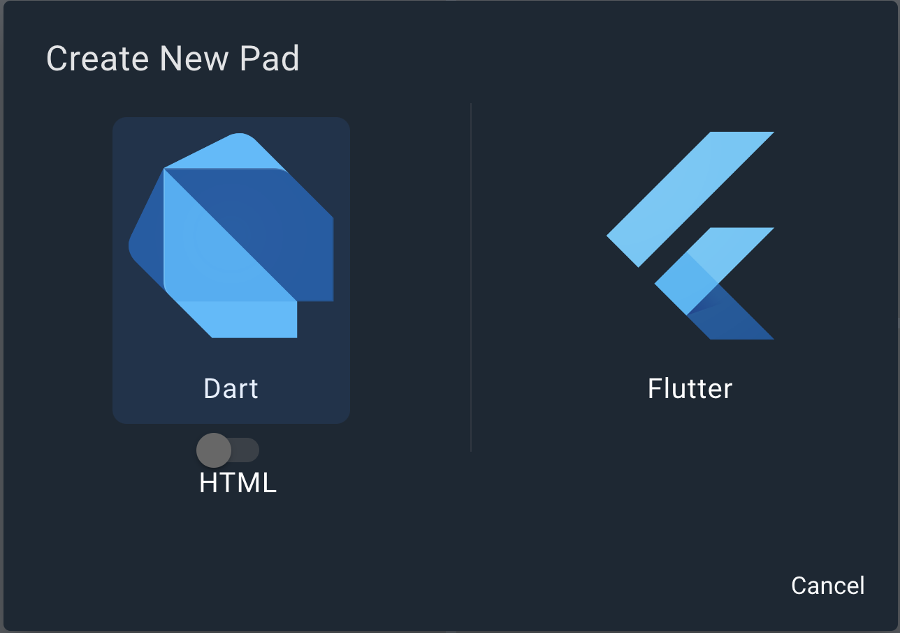
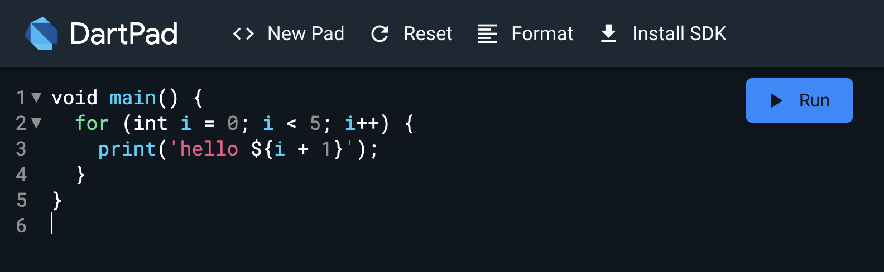
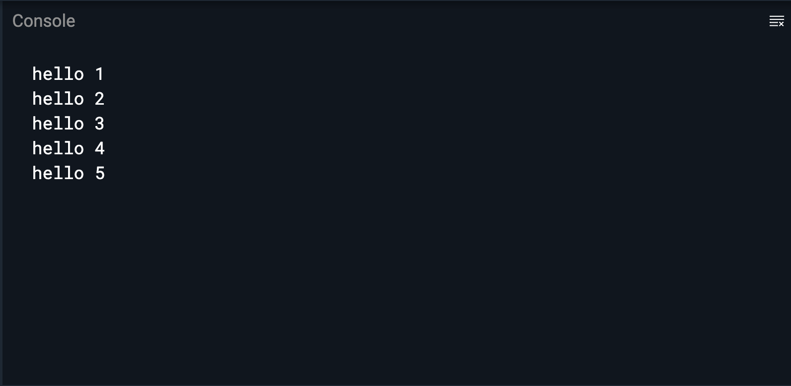
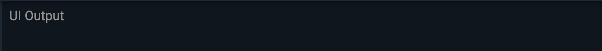
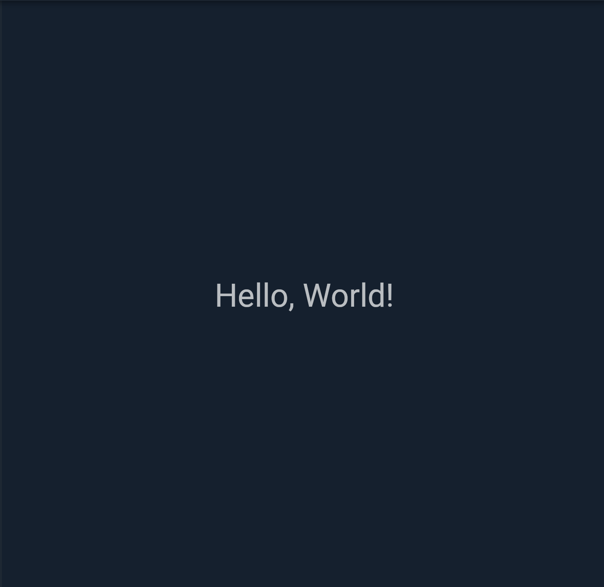
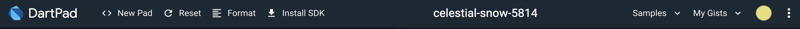
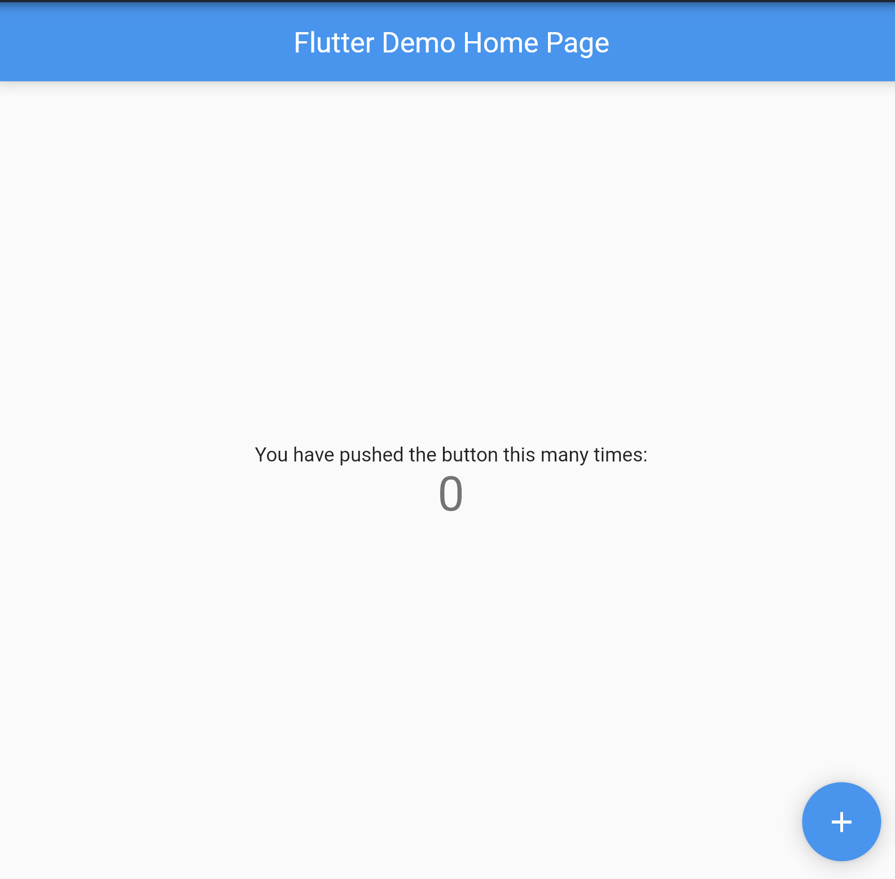
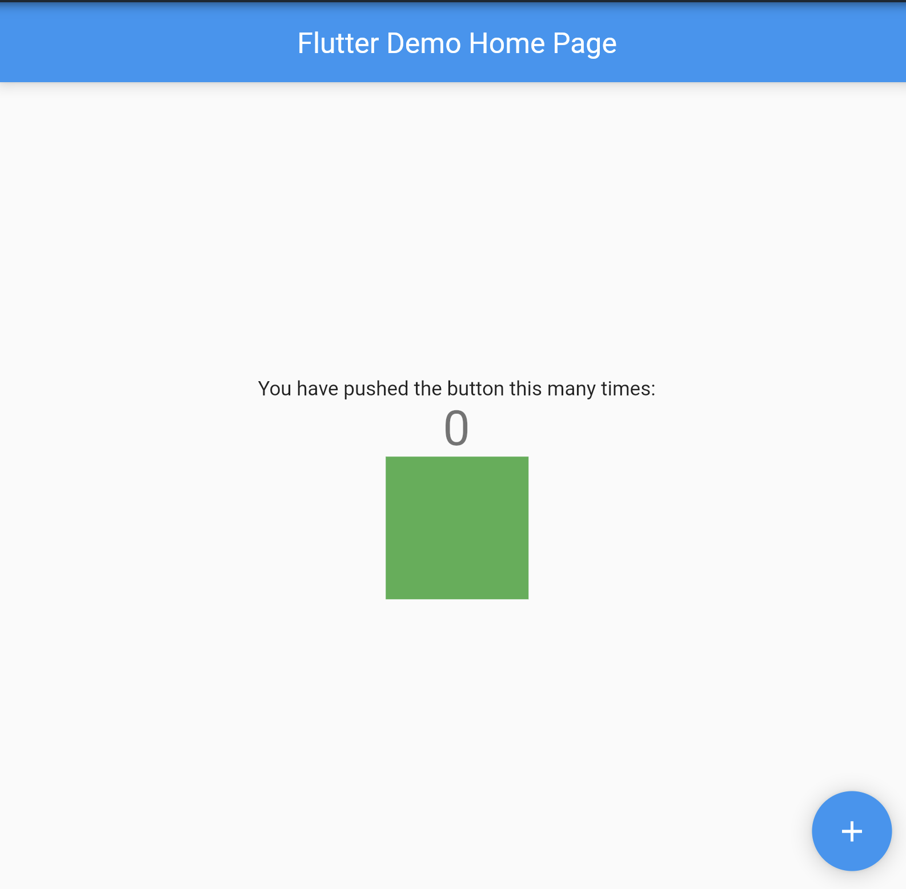
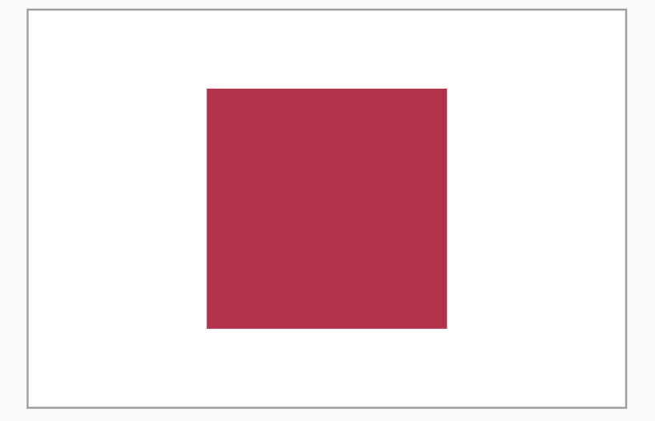
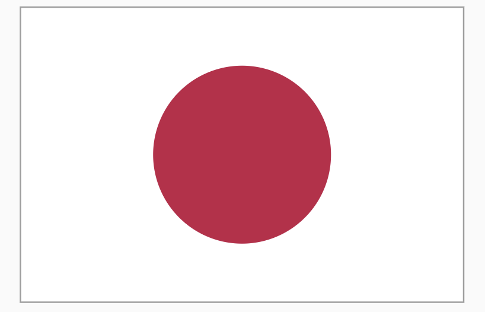

## 🌱 はじめに

DartPadという公式のオンラインIDEを使って、国旗を表示するアプリを作っていきましょう！
DartPadはこちら！ → https://dartpad.dev

## :tada: 今回のゴール

- DartPad で Dart と Flutter のプログラムを実行できるようになること
- Widget が何かを理解できること
- カスタム Widget が作成できること
- `Container`, `Column`, `Row` の使い方を理解できること 

終了時にこれらを達成できていれば完璧です！
頑張っていきましょう。

## 1. :beginner: Flutter と DartPad に触れてみよう！

国旗作りに入る前に、Flutter と DartPad について、軽くお勉強しましょう。

### :thinking: Flutterとは :thinking:

Flutter は Google が提供する、マルチプラットフォームアプリケーションを構築するためのフレームワークです。
つまり、FlutterだけでAndroid, iOS, Windows, Macなどさまざまな機器を対象としたアプリを作成することができます。

開発言語としては Dart という言語を採用しています。

### :muscle: DartPad でプログラムを動かしてみよう :muscle:

Flutter が何かわかったと思うので、ここでは、DartPad でプログラムを動かしてみましょう。

まずは、Flutterではなく、Dartのプログラムを動かしてみます。
DartPad を開いて、画面上部の「New Pad」を選択します。



HTMLのトグルが画像のようにオフになっていることを確認して、Dartを選択します。
その後、画面左側に下記画像と同じプログラムが書かれていればOKです。



プログラムの動かし方は簡単です。Runボタンを押してみましょう。これだけで実行できます。
hello 1 から hello 5まで出力できたらOKです。



---

同じように、Flutterのプログラムを動かしてみましょう！
New Pad から今度は Flutter を選択します。右側の欄がUI Output に変わっていればOKです。



Runを押して実行してみましょう。Hello, World!が出てくるのを確認してください。



これで、Dart / Flutter どちらのプログラムも DartPad を使用して実行することができました。

- 実行するときはRunボタンを押す
- プログラムを変更しても勝手に実行されない
- 右側がUI Outputになっていれば、Flutterが書ける状態

これらを覚えて、次に進みましょう！

## 2. :thinking: Widget とは何なのか

それでは、Widgetについて学習していきます。

Widget は、Flutter の UI を構築するためのパーツのことです。
さまざまな Widget を組み合わせていくことで、UI を作っていきます。

実際にプログラムを見て確認します。
DartPadの右上に Samples というメニューがあります。



この中から、Counterというプログラムを選んで実行してみましょう。



+ボタンを押すと中央の数が増えていくプログラムです。
このアプリでは、以下のWidgetが使用されています。

- MyApp: アプリ全体の Widget (自作)
- MeterialApp: マテリアルデザイン用の Widget
- MyHomePage: カウンターやボタンを表示する Widget (自作)
- Scaffold: 画面構成を定める Widget
- AppBar: アプリケーションバー用の Widget
- Center: 中央寄せにする Widget
- Text: テキストを表示する Widget
- FloatingActionButton: アクションボタン用の Widget
- Icon: アイコンを表示する Widget

ここでは扱いませんが、Flutterには`StatelessWidget`と`StatefulWidget`という大きく2種類のWidget があります。今回は`StatelessWidget`を使用します。

### :hammer: カスタムWidget を作ってみよう :hammer:

ここでは、国旗を作る前の練習として、GreenContainer というWidget を作成していきます。
名前の通り、緑色のコンテナを作ります。大きさは縦横どちらも100pxとします。

まずは、新しいWidgetを作るときの雛形を作ります。
今あるCounter アプリの一番下にプログラムを追加していきましょう！

```dart
class GreenContainer extends StatelessWidget {
  const GreenContainer();

  @override
  Widget build(BuildContext context) {
    return Container();
  }
}
```

コードについて、軽く説明します。
`GreenContainer` という名前の `StatelessWidget` を作成しました。
この `GreenContainer` Widget が中にどんなWidgetを持つか、を build というメソッドの中に書き込んでいきます。

続いて、Containerに色と大きさを指定します。
Flutterでは、Widgetごとにいろいろな引数が用意されているので、そちらを使用します。

```dart
class GreenContainer extends StatelessWidget {
  const GreenContainer();

  @override
  Widget build(BuildContext context) {
    return Container(
      width: 100,
      height: 100,
      color: Colors.green,
    );
  }
}
```

はい、これで `GreenContainer` の完成です。
右側のアプリで表示できるように、回数を表示している Text が入っている Column Widget の中に追加します。

(たぶん61行目)

```dart
child: Column(
  mainAxisAlignment: MainAxisAlignment.center,
  children: [
    const Text(
      '右下のボタンが押された回数:',
    ),
    Text(
      '$_counter',
      style: Theme.of(context).textTheme.headlineMedium,
    ),
    const GreenContainer(), // 追加
  ],
),
```

追加できたら実行しましよう。緑の箱が追加できたら完璧です！



### :star: スクロールできるようにする :star:

このまま、Column の中にたくさんの Widget が置かれると、画面からはみ出してしまい、Overflow エラーになってしまいます。国旗を設置する前にこのエラーの対策をします。

今、50行目付近は下記のようなコードになっているかと思います。

```dart
body: Center(
  child: Column(
    mainAxisAlignment: MainAxisAlignment.center,
      children: [
        const Text(
          '右下のボタンが押された回数:',
        ),
```

この body の一番上に SingleChildScrollView という Widget を追加します。
このWidget は子要素をスクロールできるようになる Widget です。末尾に閉じ括弧を追加するのを忘れないように追加しましょう。

```dart
body: SingleChildScrollView(
  child: Center(
    child: Column(
      mainAxisAlignment: MainAxisAlignment.center,
      children: [
        const Text(
          '右下のボタンが押された回数:',
        ),
```

## 3. :fire: 国旗作り

ここから、本題の国旗作りに突入します。

### :jp: 日本

はじめに日本の国旗作りにチャレンジします。
[Wikipedia](https://ja.wikipedia.org/wiki/%E6%97%A5%E6%9C%AC%E3%81%AE%E5%9B%BD%E6%97%97) をみたら以下のように記載がありました。

> 「国旗及び国歌に関する法律」（通称：国旗・国歌法）の規定によれば、「旗の形は縦が横の3分の2の長方形。日章の直径は縦の5分の3で中心は旗の中心。地色は白色、日章は紅色」とされている。上下・左右対称である。

ということで、これを仕様として作っていきます。

##### FlagJp Widget を作る

先ほどと同じように雛形から作成します。
今回は `FlagJp` という名前の Widget を作成しましょう。

```dart
class FlagJp extends StatelessWidget {
  const FlagJp();

  @override
  Widget build(BuildContext context) {
    return Container();
  }
}
```

枠線と大きさを設定していきます。
大きさは、縦横比が2:3となるように、幅300、高さ200とします。
枠線は `BoxDecoration` というクラスを使用して作っていきます。

```dart
class FlagJp extends StatelessWidget {
  const FlagJp();

  @override
  Widget build(BuildContext context) {
    return Container(
      width: 300,
      height: 200,
      decoration: BoxDecoration(
        color: Colors.white,
        border: Border.all(color: Colors.grey),
      ),
    );
  }
}
```

枠だけ表示してみます。
GreenContainer の下に追加して、確認できるようにします。

```dart
child: Column(
  mainAxisAlignment: MainAxisAlignment.center,
  children: [
    const Text(
      '右下のボタンが押された回数:',
    ),
    Text(
      '$_counter',
      style: Theme.of(context).textTheme.headlineMedium,
    ),
    const GreenContainer(),
    const SizedBox(height: 10), // 追加
    const FlagJp(), // 追加
  ],
),
```

枠があることを確認してください。


##### 🔴 日の丸を作る

次は日の丸をつくります。

- 日の丸の直径は、高さの60%
- 色は紅色( #C22047 )

1. 枠の中央に、縦横どちらも、高さの60%の大きさの赤い箱を作ります
   a. Containerの中にさらに Widget を設置したいときは、child という引数を使用します
   b. Flutter では、`Color(0xFFC22047)` と指定できます
   c. 親の Container の alignment に `Alignment.center` を指定すると、子要素が中央に配置されます
   d. 子要素のContainerにも大きさ指定を忘れずに！

abcの手順に沿って、プログラムを追加していきましょう。
FlagJpのContainerのchildにContainerをもう1つ作成し、色を指定します。
また、親のContainerの`alignment`を追加します。

```dart
class FlagJp extends StatelessWidget {
  const FlagJp();

  @override
  Widget build(BuildContext context) {
    return Container(
      width: 300,
      height: 200,
      decoration: BoxDecoration(
        color: Colors.white,
        border: Border.all(color: Colors.grey),
      ),
      alignment: Alignment.center, // (c) 子要素を中央に配置する
      child: Container( // (a) Container を追加
        width: 200 * 0.6, // (d) 大きさの指定
        height: 200 * 0.6, // (d) 大きさの指定
        color: const Color(0xFFC22047), // (b) 色の指定
      ), // (a) Container を追加
    );
  }
}
```



あとは丸くするだけです！
丸くするのには、BoxDecorationのshapeパラメータを使用します。

```dart
class FlagJp extends StatelessWidget {
  const FlagJp();

  @override
  Widget build(BuildContext context) {
    return Container(
      width: 300,
      height: 200,
      decoration: BoxDecoration(
        color: Colors.white,
        border: Border.all(color: Colors.grey),
      ),
      alignment: Alignment.center,
      child: Container(
        width: 200 * 0.6,
        height: 200 * 0.6,
        // ここから追加
        decoration: const BoxDecoration(
          // decorationパラメータがあるときは、colorは中に移動させる
          color: Color(0xFFC22047), 
          shape: BoxShape.circle,
        ),
        // 追加ここまで
      ),
    );
  }
}
```

:tada: 完成です :tada:



パラメータの書き方が理解できたところで、次の国旗にチャレンジしてみましょう！

### :de: ドイツ

ドイツ国旗の FlagDe Widgetを作成しましょう

仕様

- 大きさは日本国旗と同じく、横300、縦200
- 黒: `Color(0xFF000000)`, 赤: `Color(0xFFED1A3D)`, 金: `Color(0xFFFFD700)`

要素を縦に並べるときは、Column Widget を使用します。

```dart
class FlagDe extends StatelessWidget {
  const FlagDe();

  @override
  Widget build(BuildContext context) {
    return Container(
      width: 300,
      height: 200,
      decoration: BoxDecoration(
        // 枠を作ろう
      ),
      child: Column(
        children: [
          // Containerには色と大きさの指定が必要です
          Container(),
          Container(),
          Container(),
        ],
      ),
    );
  }
}
```

続きを考えて実装してみましょう！

### :fr: フランス

フランス国旗の FlagFr Widget を作成しましょう。

仕様

- 大きさは日本国旗と同じく、横300、縦200
- 青: `Color(0xFF002395)`、赤: `Color(0xFFED2939)`

要素を横に並べるときは、Row Widget を使用します。

```dart
class FlagFr extends StatelessWidget {
  const FlagFr();

  @override
  Widget build(BuildContext context) {
    return Container(
      width: 300,
      height: 200,
      decoration: BoxDecoration(
        // 枠を作ろう
      ),
      child: Row(
        children: [
          // Containerには色と大きさの指定が必要です
          Container(),
          Container(),
          Container(),
        ],
      ),
    );
  }
}
```

続きを考えて実装してみましょう！