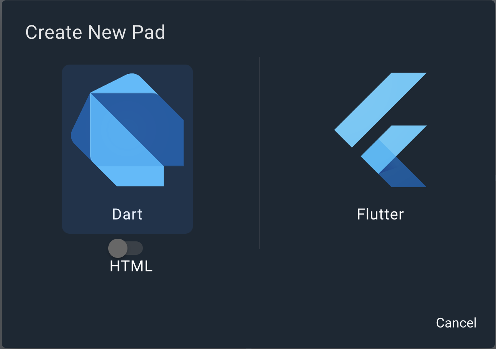
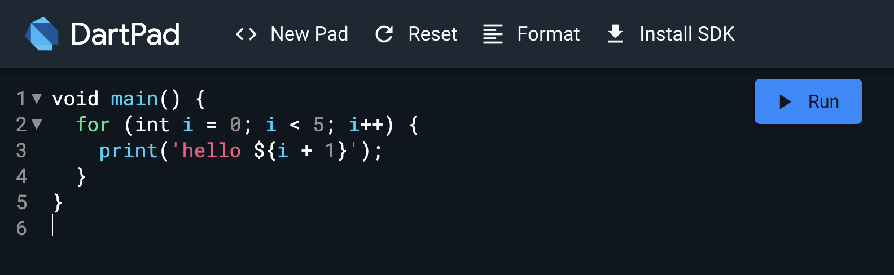
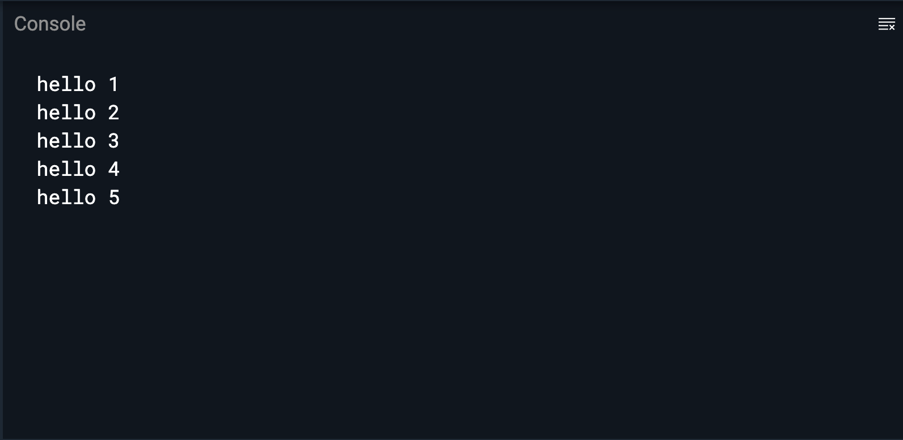
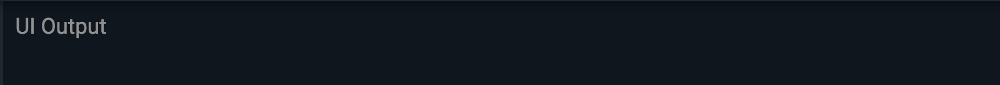
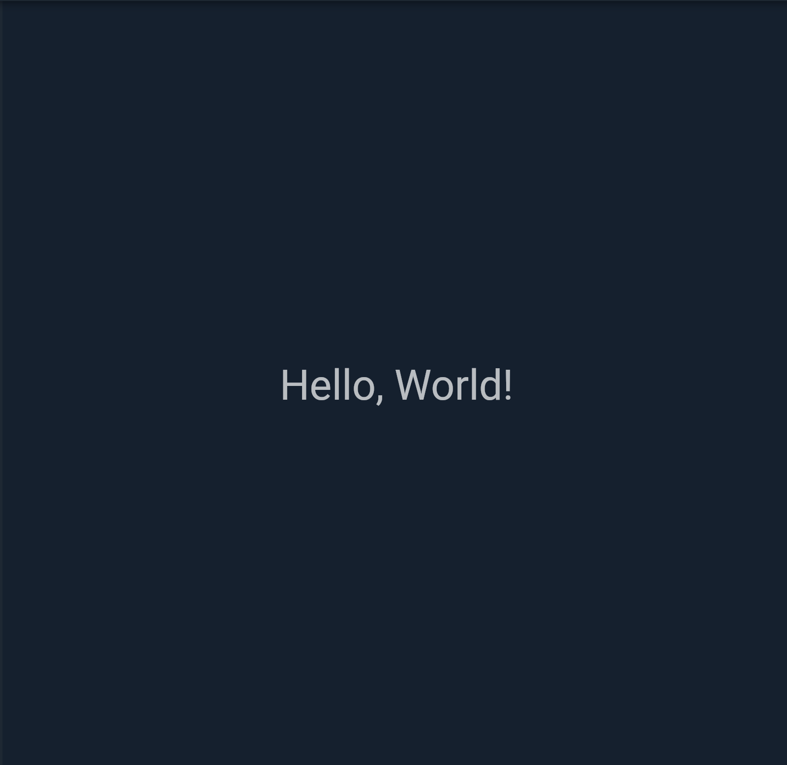
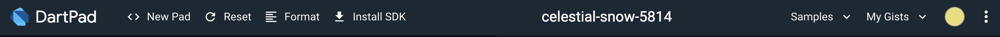
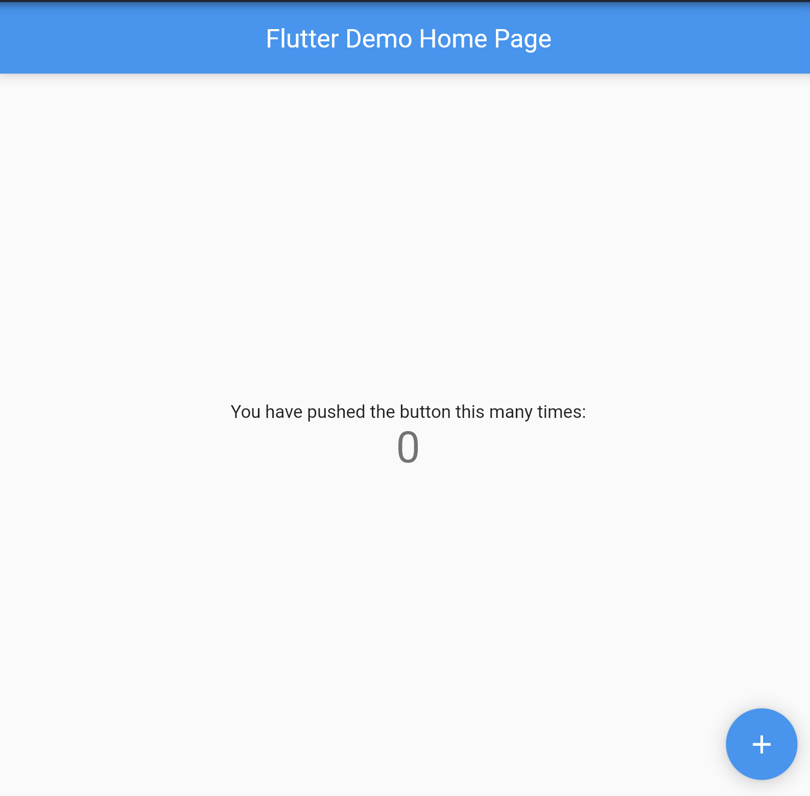

## 🌱 はじめに

DartPadという公式のオンラインIDEを使って、Todoリストを作っていきましょう！  
DartPadはこちら！ → [https://dartpad.dev](https://dartpad.dev)

## 🎉 今回のゴール

- DartPad で Dart と Flutter のプログラムが実行できること
- Widget とは何かを理解できること
- StatelessWidget, StatefulWidget がわかること
- StatefulWidgetでの状態の持ち方・更新の仕方がわかること

終了時にこれらを達成できていれば完璧です！  
頑張っていきましょう。

## 1. 🔰 Flutter と DartPad に触れてみよう！

Flutter と DartPad について、軽くお勉強しましょう。  

### 🤔 Flutterとは 🤔

Flutter は Google が提供する、マルチプラットフォームアプリケーションを構築するためのフレームワークです。  
つまり、FlutterだけでAndroid, iOS, Windows, Macなどさまざまな機器を対象としたアプリを作成することができます。  

開発言語としては Dart という言語を採用しています。  

### 💪 DartPad でプログラムを動かしてみよう 💪

Flutter が何かわかったと思うので、ここでは、DartPad でプログラムを動かしてみましょう。

まずは、Flutterではなく、Dartのプログラムを動かしてみます。  
DartPad を開いて、画面上部の「New Pad」を選択します。



HTMLのトグルが画像のようにオフになっていることを確認して、Dartを選択します。  
その後、画面左側に下記画像と同じプログラムが書かれていればOKです。



プログラムの動かし方は簡単です。Runボタンを押してみましょう。これだけで実行できます。  
hello 1 から hello 5まで出力できたらOKです。



---

同じように、Flutterのプログラムを動かしてみましょう！  
New Pad から今度は Flutter を選択します。右側の欄がUI Output に変わっていればOKです。



Runを押して実行してみましょう。Hello, World!が出てくるのを確認してください。



これで、Dart / Flutter どちらのプログラムも DartPad を使用して実行することができました。

- 実行するときはRunボタンを押す
- プログラムを変更しても勝手に実行されない
- 右側がUI Outputになっていれば、Flutterが書ける状態

これらを覚えて、次に進みましょう！

## 2. 🧐 Widget とは何なのか

それでは、Widgetについて学習していきます。

Widget は、Flutter の UI を構築するためのパーツのことです。  
さまざまな Widget を組み合わせていくことで、UI を作っていきます。

実際にプログラムを見て確認します。  
DartPadの右上に Samples というメニューがあります。



この中から、Counterというプログラムを選んで実行してみましょう。



+ボタンを押すと中央の数が増えていくプログラムです。  
このアプリでは、以下のWidgetが使用されています。

- MyApp: アプリ全体の Widget (自作)
- MeterialApp: マテリアルデザイン用の Widget
- MyHomePage: カウンターやボタンを表示する Widget (自作)
- Scaffold: 画面構成を定める Widget
- AppBar: アプリケーションバー用の Widget
- Center: 中央寄せにする Widget
- Text: テキストを表示する Widget
- FloatingActionButton: アクションボタン用の Widget
- Icon: アイコンを表示する Widget

## 2. 👀 `StatelessWidget` と `StatefulWidget`

Flutter で使用される Widget は大きく2つに分けることができます。  
`StatelessWidget` と `StatefulWidget` です。

名前の通りですが、**state があるかどうか** という違いがあります。

### 🧐 state とは？

Flutter の[公式ドキュメント](https://docs.flutter.dev/development/data-and-backend/state-mgmt/declarative)では、下記画像のように、build という function ( 関数 ) に、state を渡すことで、UI が構築されるという説明があります。

<center></center>

Widget は、アプリの状態を表示するための設計図といった形で、状態( state )が与えられると、Widget の build メソッドが UI を構築します。  
この状態( state )を必要とする Widget は StatefulWidget 、必要としないものは StatelessWidget を用いて作成していきます。

### ✏️ StatelessWidget

最初に動かした「Hello World」と出てくるだけのアプリでは、時間経過やユーザーの操作に応じてUIが変わることがありませんね。  
そういった**一度構築したらその後は変化しないもの**については、StatelessWidgetを使用します。

```dart
// StatelessWidgetでは、状態がないのでbuildメソッドもWidgetクラスに直接書く
class Hoge extends StatelessWidget {
 Hoge({super.key});

 @override
 Widget build(BuildContext context) {
   return Container();
 }
}
```

### ✏️ StatefulWidget

一方で、今動かしているカウントアプリでは、ユーザーが+ボタンを押すたび、押した回数を表示を増やしていく必要があります。  
このような、**UIが動的に変化する必要があるもの**については、StatefulWidgetを使用します。

`StatefulWidget` は変更可能な状態を別の `State` クラスに保存します。
すべての `StatefulWidget` は必ず、`createState()` メソッドをオーバーライドして、`State` クラスを返すように実装する必要があります。 

下記の例では、`Fuga` という `StatefulWidget` で、`_FugaState` という `State` を `createState()` で返すようにしています。  
そして、その `_FugaState` の中でチェックボックスがチェックされているかどうかを示す、`isChecked` という bool 値( true / false )を状態として持っています。  

この状態をただ更新するだけでは、UIは更新されません。状態を更新する場合は、`setState(() {})` メソッドを叩きます。  
UIを更新して `setState` を行うと、必要な部分のUIが再構築(リビルド)されます。

```dart
// StatefulWidgetでは、状態のクラス(State)を作成して、状態もbuildメソッドもそちらのクラスに記入する
class Fuga extends StatefulWidget {
 Fuga({super.key});

 @override
 State<Fuga> createState() => _FugaState();
}

class _FugaState extends State<Fuga> {
 bool isChecked = false; // これが状態(state) 

 @override
 Widget build(BuildContext context) {
   return Container(
     child: CheckBox(
       value: isChecked,
       onChanged: (value) {
         // 値を更新する時は、setStateを使う
         setState(() {
           isChecked = value;
         });
       },
     ),
   );
 }
}
```

## 🔥 TODOリストを作ってみよう！

お勉強パートが少し長くなってしまいましたが、ここからは早速Todoリストを実装していきましょう！  
今回は時間の都合上、UIのプログラムだけこちらで実装しました。

プログラム -> [https://gist.github.com/nabe1005/c16d824012173f85d8df521a3771b123](https://gist.github.com/nabe1005/c16d824012173f85d8df521a3771b123)

まず、DartPad を開いて、画面上部の「Counter example」と書いてあるタイトル部分をクリックしてください。  
編集ができるはずなので、「Todo List」などの適当な名前に変えてください。  
名前が変更できたら、上記 Gist のリンクからプログラムを全てコピーして、DartPad に持ってきてください。

一度、試しに動作させてみましょう。正しくプログラムが動作している場合は下記のようになるかと思います。  
このプログラムは未完成で、一部機能が動作しなくなっています(意図的に該当部分のプログラムだけ未実装のままにしています)。

- チェックボックスを押しても反応しない
- やることを入力しても追加されない

このあと、この2機能の実装にチャレンジしてみます。

<center>

</center>