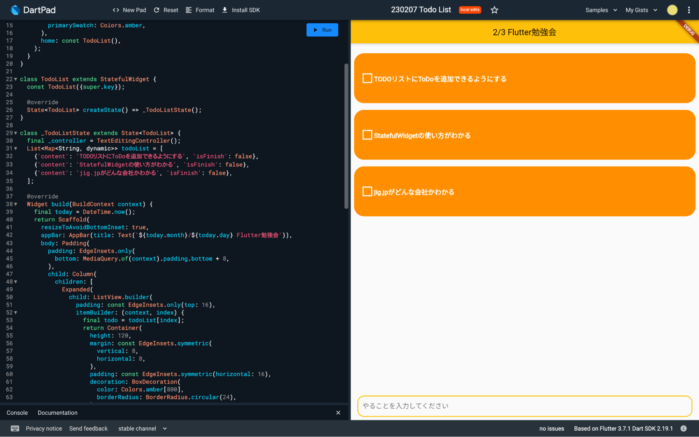

## 🌱 はじめに

DartPadという公式のオンラインIDEを使って、Todoリストを作っていきましょう！  
DartPadはこちら！ → [https://dartpad.dev](https://dartpad.dev)

## 🎉 今回のゴール

- DartPad で Dart と Flutter のプログラムが実行できること
- Widget とは何かを理解できること
- StatelessWidget, StatefulWidget がわかること
- StatefulWidgetでの状態の持ち方・更新の仕方がわかること

終了時にこれらを達成できていれば完璧です！  
頑張っていきましょう。

## 1. 🔰 Flutter と DartPad に触れてみよう！

Flutter と DartPad について、軽くお勉強しましょう。  

### 🤔 Flutterとは

Flutter は Google が提供する、マルチプラットフォームアプリケーションを構築するためのフレームワークです。  
つまり、FlutterだけでAndroid, iOS, Windows, Macなどさまざまな機器を対象としたアプリを作成することができます。  

開発言語としては Dart という言語を採用しています。  

### 💪 DartPad でプログラムを動かしてみよう

Flutter が何かわかったと思うので、ここでは、DartPad でプログラムを動かしてみましょう。

まずは、Flutterではなく、Dartのプログラムを動かしてみます。  
DartPad を開いて、画面上部の「New Pad」を選択します。


HTMLのトグルが画像のようにオフになっていることを確認して、Dartを選択します。  
その後、画面左側に下記画像と同じプログラムが書かれていればOKです。


プログラムの動かし方は簡単です。Runボタンを押してみましょう。これだけで実行できます。  
hello 1 から hello 5まで出力できたらOKです。


---

同じように、Flutterのプログラムを動かしてみましょう！  
New Pad から今度は Flutter を選択します。右側の欄がUI Output に変わっていればOKです。


Runを押して実行してみましょう。Hello, World!が出てくるのを確認してください。


これで、Dart / Flutter どちらのプログラムも DartPad を使用して実行することができました。

- 実行するときはRunボタンを押す
- プログラムを変更しても勝手に実行されない
- 右側がUI Outputになっていれば、Flutterが書ける状態

これらを覚えて、次に進みましょう！

## 2. 🧐 Widget とは何なのか

それでは、Widgetについて学習していきます。

Widget は、Flutter の UI を構築するためのパーツのことです。  
さまざまな Widget を組み合わせていくことで、UI を作っていきます。

実際にプログラムを見て確認します。  
DartPadの右上に Samples というメニューがあります。


この中から、Counterというプログラムを選んで実行してみましょう。


+ボタンを押すと中央の数が増えていくプログラムです。  
このアプリでは、以下のWidgetが使用されています。

- MyApp: アプリ全体の Widget (自作)
- MeterialApp: マテリアルデザイン用の Widget
- MyHomePage: カウンターやボタンを表示する Widget (自作)
- Scaffold: 画面構成を定める Widget
- AppBar: アプリケーションバー用の Widget
- Center: 中央寄せにする Widget
- Text: テキストを表示する Widget
- FloatingActionButton: アクションボタン用の Widget
- Icon: アイコンを表示する Widget

## 3. 👀 `StatelessWidget` と `StatefulWidget`

Flutter で使用される Widget は大きく2つに分けることができます。  
`StatelessWidget` と `StatefulWidget` です。

名前の通りですが、**state があるかどうか** という違いがあります。

### 🧐 state とは？

Flutter の[公式ドキュメント](https://docs.flutter.dev/development/data-and-backend/state-mgmt/declarative)では、下記画像のように、build という function ( 関数 ) に、state を渡すことで、UI が構築されるという説明があります。

<center></center>

Widget は、アプリの状態を表示するための設計図といった形で、状態( state )が与えられると、Widget の build メソッドが UI を構築します。  
この状態( state )を必要とする Widget は StatefulWidget 、必要としないものは StatelessWidget を用いて作成していきます。

### ✏️ StatelessWidget

最初に動かした「Hello World」と出てくるだけのアプリでは、時間経過やユーザーの操作に応じてUIが変わることがありませんね。  
そういった**一度構築したらその後は変化しないもの**については、StatelessWidgetを使用します。

```dart
// StatelessWidgetでは、状態がないのでbuildメソッドもWidgetクラスに直接書く
class Hoge extends StatelessWidget {
 Hoge({super.key});

 @override
 Widget build(BuildContext context) {
   return Container();
 }
}
```

### ✏️ StatefulWidget

一方で、今動かしているカウントアプリでは、ユーザーが+ボタンを押すたび、押した回数を表示を増やしていく必要があります。  
このような、**UIが動的に変化する必要があるもの**については、StatefulWidgetを使用します。

`StatefulWidget` は変更可能な状態を別の `State` クラスに保存します。
すべての `StatefulWidget` は必ず、`createState()` メソッドをオーバーライドして、`State` クラスを返すように実装する必要があります。 

下記の例では、`Fuga` という `StatefulWidget` で、`_FugaState` という `State` を `createState()` で返すようにしています。  
そして、その `_FugaState` の中でチェックボックスがチェックされているかどうかを示す、`isChecked` という bool 値( true / false )を状態として持っています。  

この状態をただ更新するだけでは、UIは更新されません。状態を更新する場合は、`setState(() {})` メソッドを叩きます。  
UIを更新して `setState` を行うと、必要な部分のUIが再構築(リビルド)されます。

```dart
// StatefulWidgetでは、状態のクラス(State)を作成して、状態もbuildメソッドもそちらのクラスに記入する
class Fuga extends StatefulWidget {
 Fuga({super.key});

 @override
 State<Fuga> createState() => _FugaState();
}

class _FugaState extends State<Fuga> {
 bool isChecked = false; // これが状態(state) 

 @override
 Widget build(BuildContext context) {
   return Container(
     child: CheckBox(
       value: isChecked,
       onChanged: (value) {
         // 値を更新する時は、setStateを使う
         setState(() {
           isChecked = value;
         });
       },
     ),
   );
 }
}
```

## 4. 🔥 TODOリストを作ってみよう！

お勉強パートが少し長くなってしまいましたが、ここからは早速Todoリストを実装していきましょう！  
今回は時間の都合上、UIのプログラムだけこちらで実装しました。

プログラム -> [https://gist.github.com/nabe1005/c16d824012173f85d8df521a3771b123](https://gist.github.com/nabe1005/c16d824012173f85d8df521a3771b123)

まず、DartPad を開いて、画面上部の「Counter example」と書いてあるタイトル部分をクリックしてください。  
編集ができるはずなので、「Todo List」などの適当な名前に変えてください。  
名前が変更できたら、上記 Gist のリンクからプログラムを全てコピーして、DartPad に持ってきてください。

一度、試しに動作させてみましょう。正しくプログラムが動作している場合は下記のようになるかと思います。  
このプログラムは未完成で、一部機能が動作しなくなっています(意図的に該当部分のプログラムだけ未実装のままにしています)。

- チェックボックスを押しても反応しない
- やることを入力しても追加されない

このあと、この2機能の実装にチャレンジしてみます。

<center>

</center>

### 🔍 コピーしてきたプログラムを確認しよう！

では、実装に進む前に一度コピーしてきたプログラムを確認していきましょう。

Widget としては、`TodoList` という StatefulWidget があってこれがアプリの画面全体の Widget となっています。  
持っている状態として、`List<Map<String, dynamic>>` 型の `todoList` という変数が用意されていて、サンプルとして中に3つほど値が入っています。  
変数の型については理解できなくても OK です。`todoList` は json の配列になっているとイメージしてください。  

この `todoList` がタスク一覧となっています。中身の値に着目してみると、`content` と `isFinish` という値があります。  
`content` には入力された「タスクの内容」、`isFinish` には「タスクの完了状態」が設定されています。  
ためしに、好きなタスクの `isFinish` を `true` にして動かしてみるとチェックボックスにチェックが入ることが確認できます。  

### ✅ タスクを完了させられるようにしよう！

早速、1つ目の実装として、タスクを完了させられるようにしていきます。  
チェックボックスを押したら、チェックをつけたり外したりできるようにして、タスクの完了・未完了を切り替えられるようにしましょう。

前のセクションで説明しましたが、タスクの完了状態は `isFinish` フラグで判定しています。  
ひとつひとつのタスクは、52 行目からの `ListView.builder()` ウィジェット内の `itemBuilder` で表示させています。

`itemBuilder` で `index` を受け取ることができるので、53 行目で `todoList` から `index` 番のタスクを `todo` 変数に代入しています。

まず、チェックボックスを表示している `CheckBox` Widget を探してみましょう。

やや見づらいかもしれませんが、`CheckBox` は `value`, `onChanged`, `side` の3つのパラメータが指定されています。

`value` にはチェックボックスの状態を指定する値を指定します。  
今回は `todo` の `isFinish` が指定されています( `todo['isFinish']` )。  
side では枠線の指定をしていて、今回は枠線を白く・太くなるよう設定しています。

最後に `onChanged` ですが、名前の通りチェックボックスの値が切り替わるタイミングでこの中に書いた処理が実行されます。  
引数として `v` を受け取っていますが、これには更新後のチェックボックスの値が代入されています。  
つまり、チェックが入ってない状態でチェックボックスが押されると、`v` に `true` が入った状態で `onChanged` が動きます。  
コメントの通り、今は何の処理も行っていませんが、ここにチェックボックスの値を更新するプログラムを書けば、チェックボックスを動かせそうですね。

ここまでの内容を使って考えると、以下のように実装すればうまく動きそうですね！

--- 

状態を更新するときは下記プログラムのように `setState` を呼びます。  
`isFinish` が適切に更新されると、チェックボックスの状態が変わっていい感じに再描画してくれそうですね。  
`isFinish` にはどんな値を入れたらチェックをつけたり外したりできるでしょうか？

では1つ目からやっていきましょう。  
チェックボックスの値が切り替わるたびに動く、`onChanged` というパラメータを探しましょう。  
上述のとおり、そこでは更新後の値 `v` を受け取った関数となってます。

その関数内でチェックボックスの値(状態)を更新するので、ひとまずこの中で `setState` を呼びます。

```dart
onChanged: (v) {
  // チェックマークを押したとき
  // 完了状態を変えるプログラムを書こう！
  setState(() {});
}
```

ではこの `setState` の中で `isFinish` の更新を行います。  
`CheckBox` Widget の状態を指定するパラメータの `value` では、`isFinish` が使われていますが、どのように指定されてるかを確認しながら、その値を更新します。  
`onChanged` の引数 `v` には、更新後の値が入るので、`isFinish` に `v` を代入すれば良さそうですね。

```dart
onChanged: (v) {
  // チェックマークを押したとき
  // 完了状態を変えるプログラムを書こう！
  setState(() {
    todo['isFinish'] = v;
  });
}
```

上記のように更新できたら、Run で実際にチェックボックスが動くか確認してみてください。

### 😎 TODO を追加できるようにしよう！

今度は、下のテキストフィールドから todo、やることを追加できるようにしていきます。  
テキストフィールドからテキストが送信されるタイミングで書いてある内容を `todoList` に追加できれば良さそうですね。

テキストフィールドは、101行目の `TextField` Widget で表示しています。  
テキストの送信時には、`onSubmitted` パラメータに指定された内容が動きます。  
引数には先ほどと同様 `v` を受け取っていますが、こちらには入力されたテキストが入っています。

この中身に、タスクを追加するコードを実装してみましょう！  
(一番下に解答を載せるので、見ないでやってみてください)

**⭐️ ヒント**

- 先ほどと同じように、状態を更新するときは setState を使用します
- タスクは `Map<String, dynamic>` 型 (json)で登録します
  - todoList に入ってる初期値はどんなふうに記述されているか見てみるといいかもしれません
- 配列に要素を追加する場合は、add メソッドが使えます
  - `todoList.add(追加する要素)` のように書けます
  - この下で詳しく説明します
- ★ TextField の中身を消す
  - TextField に指定している `_controller` は `TextEditingController` というもので入力されているテキストをいろいろ操作できます
  - `_controller.clear();` を呼ぶと入力されているテキストが消えます

**add メソッドについて**

dart の List 型 (配列のことです)には、要素を追加する際のメソッド、add() が用意されています。  
今回のTodoも大元は List 型となっているので、要素を追加するにはこのメソッドを使用してあげると簡単に実装することができます。

```dart
// todoListに何か追加したいとき
todoList.add({ content: 'てすと', isFinish: false });
```

## 5. ✨ 追加のカスタマイズ

上記2つの実装ができたら、以下の実装をやってみましょう。  
実装する上では、この資料に出てきてない Widget も必要に応じて利用する必要があります。  
ヒントは少なめにしています。

### タスクを削除できるようにしよう

新しいタスクを追加できるようになりましたが、間違って入力したTodoを追加してしまったときなどに消せないのはちょっと不便ですね...。  
ということで以下2つの方法のどちらかで実装してみてください。

#### 中級編: 削除用の×ボタンを設置して、タップしたら消えるようにしよう

- アイコンを設置するにはどの Widget を使えば良いでしょうか？  
  - Icon Widget でもいいですが、これだとタップした時の挙動を設定することができませんね...  
- アイコンはどこに置くと良いでしょう？  
  - デザイン的にもプログラム的にも
- 配列から要素を削除するのはどうやれば良いでしょう？

<center>

</center>

#### 上級編: 画面の右から左へスワイプした時に削除できるようにしよう

- Dismissible Widget を使ってみよう
  - [https://api.flutter.dev/flutter/widgets/Dismissible-class.html](https://api.flutter.dev/flutter/widgets/Dismissible-class.html)
- 配列から要素を削除するのはどうやれば良いでしょう？

## 6. おわり

お疲れ様でした！  
ひとまず、TODO リストが完成しました。しかし、動作としてはまだまだ必要最低限です。  
タスク一覧をアプリの状態としてしか保持していないので、アプリを再起動するとタスクが消えます。  
タスクの編集・削除、期日の設定などなど、やれることはまだまだたくさん残っています。

今回は特に触れませんでしたが、UIもあまりカスタマイズしてないままなので、上記の内容と合わせて調べてみたり作り込んでみたりしてくれると嬉しいです。

今回の内容やカスタマイズでつまづいたことがあれば、メール(intern-info@jig.jp)かTwitter(https://twitter.com/jig_saiyo)のDMで聞いてくれれば一緒に考えますので、お気軽に聞いてください！

## 7. 解答

タスクを追加してみよう！の解答を以下に示します。

onSubmitted で入力されたテキスト v を content として todoList に追加するとタスクを追加することができます。  
タスクの登録時、完了状態は絶対未完了であるはずなので、isFinish を false として登録しましょう。  
先ほどと同様に、状態の更新時には setState を呼ぶこと！

```dart
onSubmitted: (String v) {
  // 入力したテキストの送信時
  // 入力された文字をtodoに登録するプログラムを書こう！
  setState(() {
    todoList.add({'content': v, 'isFinish': false});
    _controller.clear();
  });
},
```