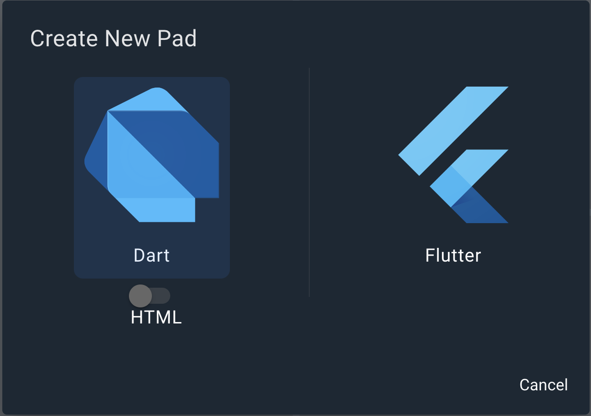
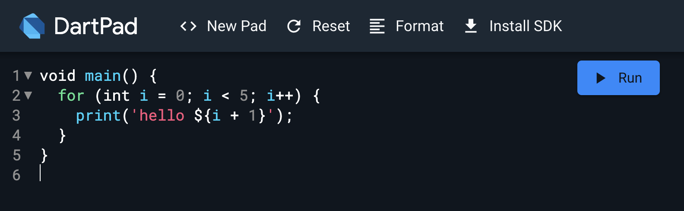
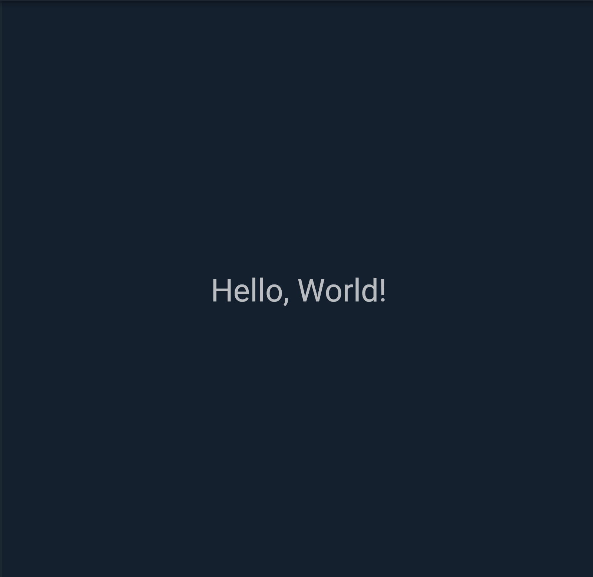

<style scoped>
  section {
    color: #505050;
    font-size: 32px;
  }
  img {
    padding-bottom: 32px;
  }
  </style>


# DartPadを使用して<br>TODOアプリを<br>作ってみよう

---


- 渡部 泰生 ( わたなべ たいき )
- 社内では「なべ」と呼ばれています
- アプリ開発を担当しています
  - Flutterをよく使ってます
- 新卒採用も担当しています

---


- 三宅 武将（みやけ たける）
- アプリ開発を担当
- iOS(Swift) の開発もしています
- 趣味は写真を撮ること

---

## :muscle: 今日やること :muscle:

DartPadという公式のオンラインIDEを使って、<br>TODOリストを作っていきましょう！

DartPadはこちら！ → https://dartpad.dev

---

## :tada: 今回のゴール :tada:

<style scoped>
  section {
    font-size: 36px;
  }
  </style>

- DartPad で Dart と Flutter のプログラムが実行できること
- Widget とは何かを理解できること
- StatelessWidget, StatefulWidget がわかること
- StatefulWidgetでの状態の持ち方・更新の仕方がわかること

<br>

**終了時にこれらを達成できていれば完璧です！<br>頑張っていきましょう！**

---

## 🔰 Flutter と DartPad に<br>触れてみよう！

Flutter と DartPad について、軽くお勉強しましょう。

---

<!-- header: 🔰 Flutter と DartPad に触れてみよう！ -->

<style scoped>
  section {
    font-size: 36px;
  }
  </style>

## Flutterとは？

Flutter は Google が提供する、
マルチプラットフォームアプリケーションを
構築するためのフレームワークです。

つまり、Flutterだけで
Android, iOS, Windows, Macなど
さまざまな機器を対象とした
アプリを作成することができます。

開発言語としては Dart という言語を採用しています。

---

### 💪 Dart のプログラムを動かしてみよう
DartPad で Dart を動かしてみましょう。<br><br>

DartPad を開いて、<br>画面上部の「New Pad」を選択します。

---



---

Runボタンで実行してみよう！



---


---

## :muscle: Flutter も動かしてみよう :muscle:

今度は New Pad から Flutter を選択！  
Run を押して実行！

---



---

### ここまで復習

- 実行するときはRunボタンを押す
- プログラムを変更しても勝手に実行されない
- 右側がUI Outputになっていれば、Flutterが書ける状態

---

<!-- header: "" -->

## 🧐 Widget とは何なのか

---

<!-- header: 🧐 Widget とは何なのか -->

### Widget とは

Widget は、Flutter の UI を構築するための<br>パーツのことです。

さまざまな Widget を組み合わせていくことで、<br>UI を作っていきます。

---


Samples -> Counter を選択して実行してみよう

---


---

<style scoped>
  section {
    font-size: 32px;
  }
</style>

- MyApp: アプリ全体の Widget (自作)
- MeterialApp: マテリアルデザイン用の Widget
- MyHomePage: カウンターやボタンを表示する Widget (自作)
- Scaffold: 画面構成を定める Widget
- AppBar: アプリケーションバー用の Widget
- Center: 中央寄せにする Widget
- Text: テキストを表示する Widget
- FloatingActionButton: アクションボタン用の Widget
- Icon: アイコンを表示する Widget

---

<!-- header: "" -->

## `StatelessWidget` <br>と<br> `StatefulWidget`

---

<!-- header: 👀 `StatelessWidget` と `StatefulWidget` -->

## 違いは、state があるかどうか

---

## 🧐 state とは


build という function ( 関数 ) に、<br>state を渡すことで、UI が構築される

---

### Widget は<br>アプリの状態を表示するための設計図

状態( state )が与えられると、<br>Widget の build メソッドが UI を構築します。

この状態( state )を必要とする Widget は StatefulWidget<br>必要としないものは StatelessWidget

---

### ✏️ StatelessWidget

一度構築したらその後は変化しないもの

```dart
// StatelessWidgetでは、状態がないのでbuildメソッドもWidgetクラスに直接書く
class Hoge extends StatelessWidget {
 Hoge({super.key});

 @override
 Widget build(BuildContext context) {
   return Container();
 }
}
```

---

### ✏️ StatefulWidget

UIが動的に変化する必要があるもの

---

```dart
// StatefulWidgetでは、状態のクラス(State)を作成して、状態もbuildメソッドもそちらのクラスに記入する
class Fuga extends StatefulWidget {
 Fuga({super.key});

 @override
 State<Fuga> createState() => _FugaState();
}

class _FugaState extends State<Fuga> {
 bool isChecked = false; // これが状態(state) 

 @override
 Widget build(BuildContext context) {
   return Container(
     child: CheckBox(
       value: isChecked,
       onChanged: (value) {
         // 値を更新する時は、setStateを使う
         setState(() {
           isChecked = value;
         });
       },
     ),
   );
 }
}
```

---

<!-- header: "" -->

## 🔥 TODOリストを作ってみよう！

---

<!-- header: 🔥 TODOリストを作ってみよう！ -->

[UIのプログラム](https://gist.github.com/nabe1005/c16d824012173f85d8df521a3771b123)


---

## 🧐 バグってる

- チェックボックスを押しても反応しない
- やることを入力しても追加されない

---

<style scoped>
  section {
    font-size: 32px;
  }
</style>

## 🔍 コピーしてきたプログラムを<br>確認しよう！

TodoList という StatefulWidget がアプリの画面全体

状態として、`List<Map<String, dynamic>>` 型の `todoList` <br><br>

※変数の型については理解できなくても OK です。
todoList は json の配列になっているとイメージしてください。

---

この `todoList` はタスク一覧となっています。

中身の値に着目してみると、
`content` と `isFinish` という値があります。

`content` には入力された「タスクの内容」
`isFinish` には「タスクの完了状態」

**好きなタスクの `isFinish` を `true` にしてみよう**
Runするとチェックマークがつくはずです

---

### ✅ タスクを完了させられるようにしよう！

---

### 😎 TODO を追加できるようにしよう！

---

## アンケート


